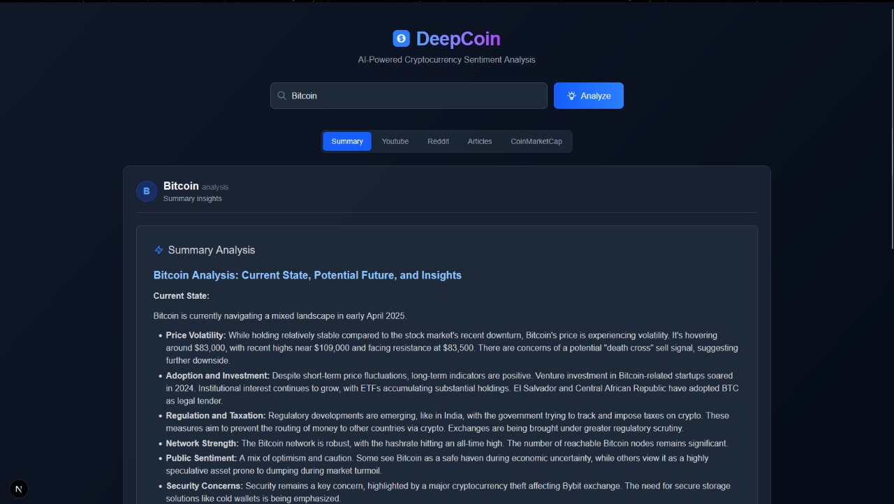
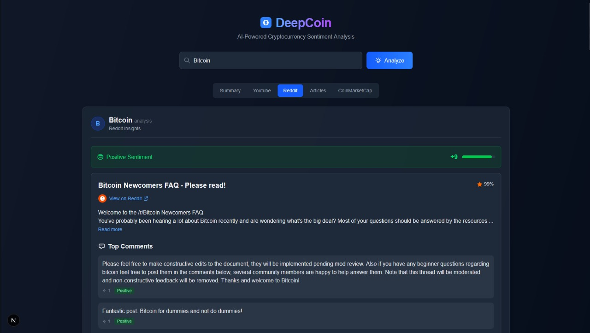
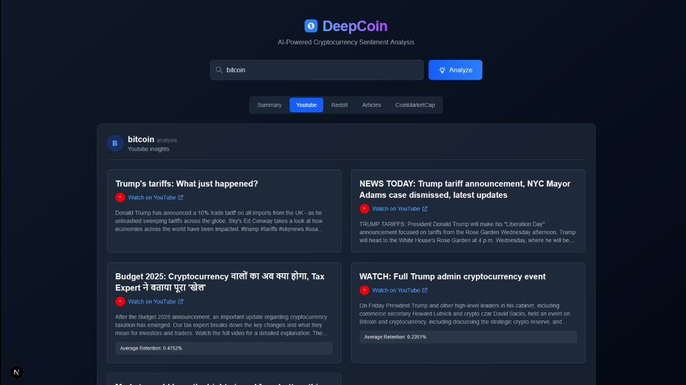
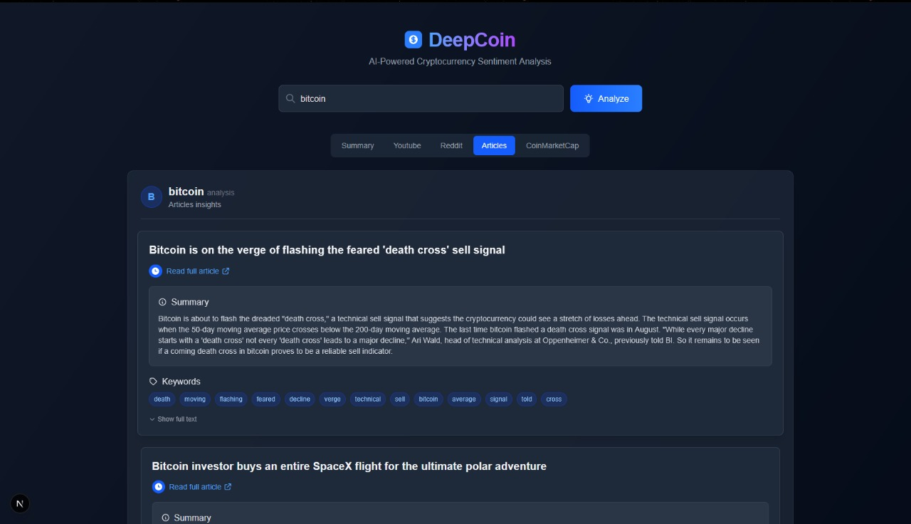
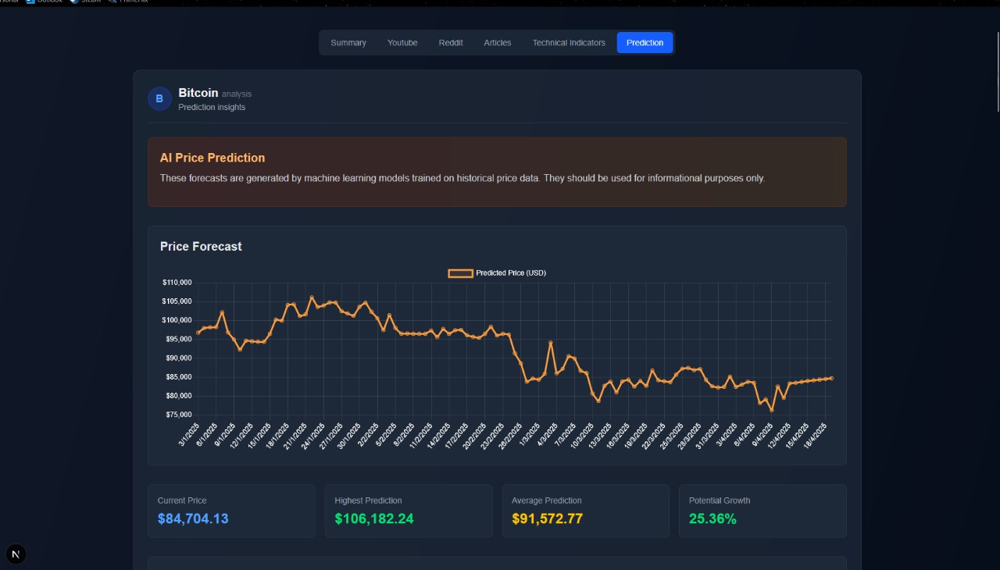

# DeepCoin - Cryptocurrency Sentiment Analysis

DeepCoin is an AI-driven platform designed to provide you with actionable insights into the cryptocurrency market. By leveraging advanced Natural Language Processing (NLP) and Machine Learning (ML) techniques, DeepCoin analyzes vast amounts of data from diverse sources to help you understand market sentiment, trends, and key technical indicators.

## Setup Instructions

1.  **Clone Repo**:
    ```bash
    git clone https://github.com/ItsSpirax/DeepCoin
    cd DeepCoin
    ```

2.  **Config Env**:
    - `cp .\Backend\.env.example .\Backend\.env`
    - Edit `.\Backend\.env`

3.  **Run Docker**:
    ```bash
    docker compose up -d
    ```

4.  **Access Website**:
    - Open browser to `http://localhost:3000`.

## Key Features

* **Comprehensive Dashboard**: A user-friendly interface providing a summary of the cryptocurrency market.

    * [](./assets/homepage.jpeg)
* **Sentiment Analysis**: Understand the public mood towards cryptocurrencies by scraping data from:
    * **Reddit**: Gauge community sentiment from posts and comments using a customized FinBERT models.

        [](./assets/reddit.jpeg)
    * **YouTube**: Extract user retention from video transcripts.

        [](./assets/youtube.jpeg)
    * **News Articles**: Summarize and analyze news articles.

        [](./assets/articles.jpeg)
* **Technical Indicators**: Access crucial technical analysis tools based on historical market data, including SMA, EMA, RSI, MACD, and OBV.

    * [](./assets/indicators.jpeg)
* **Price Prediction**: Utilize machine learning models to forecast potential future price movements.

    * [](./assets/prediction.jpeg)
* **Data Sources**: Aggregates information from platforms like Reddit, YouTube, Google News, and CoinMarketCap.

## Technologies Used

* **Frontend**: Next.js, React, Tailwind CSS
* **Backend**: Flask, PyTorch, Transformers
* **APIs**: CoinMarketCap, Google News SERP API, YouTube Data API, Reddit API
* **Machine Learning**: Sentiment analysis using FinBERT, price prediction using LSTM models

## License

This project is licensed under the MIT License. See the [LICENSE.md](LICENSE.md) file for details.
